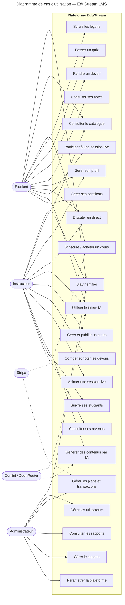
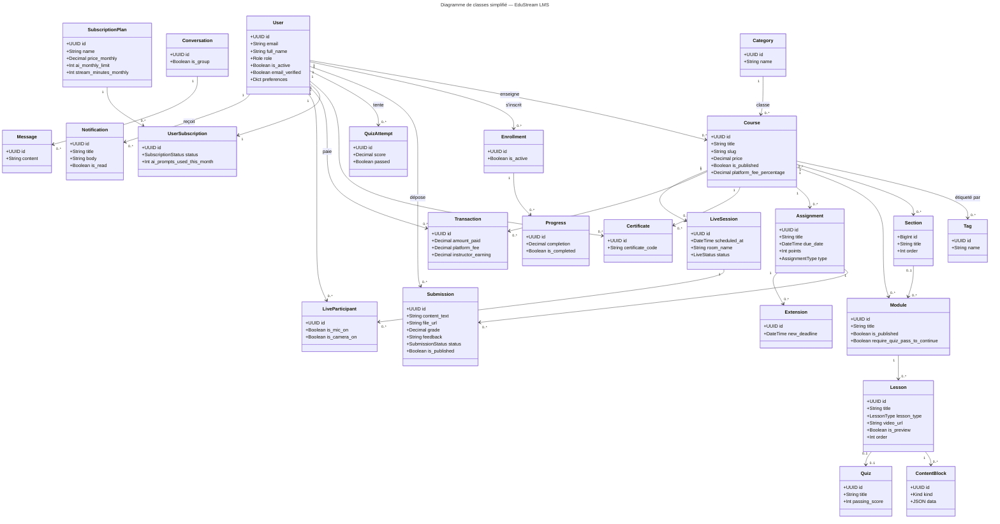
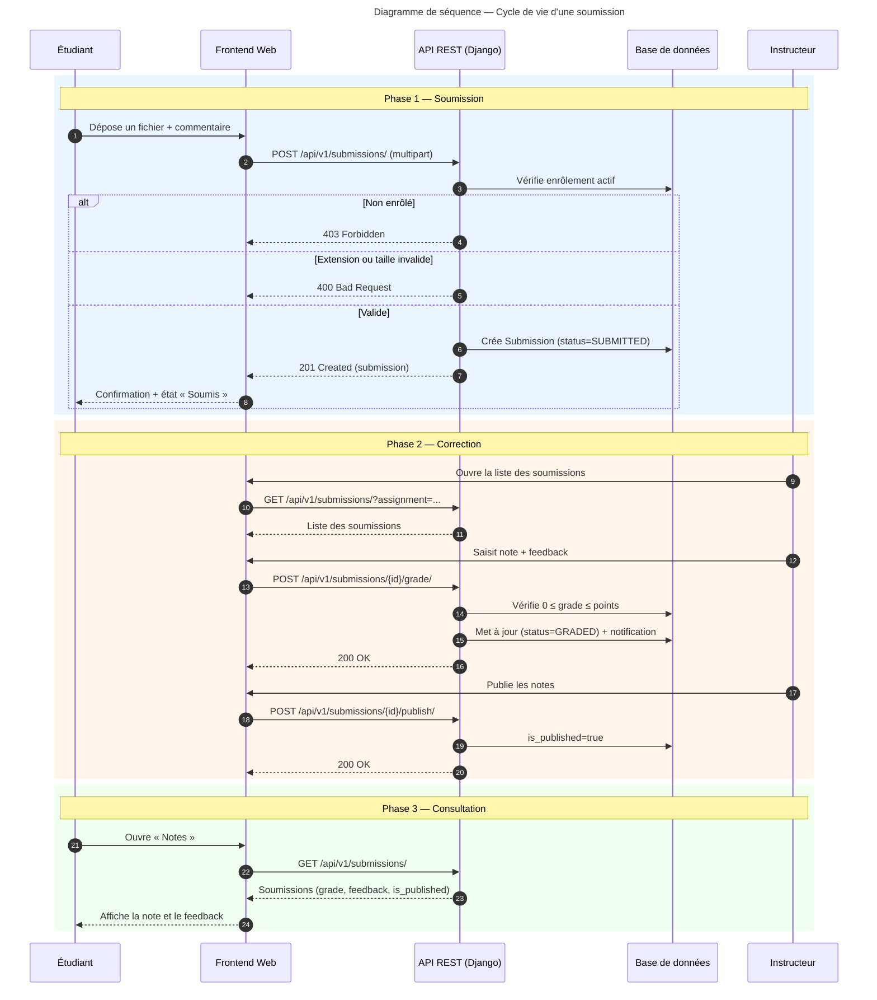
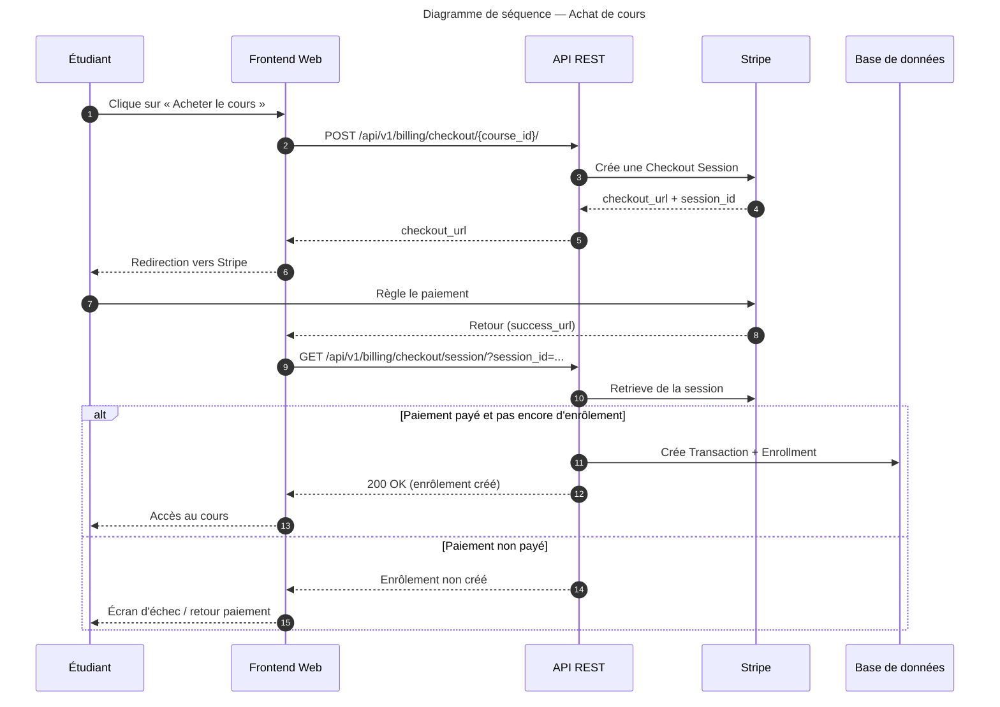
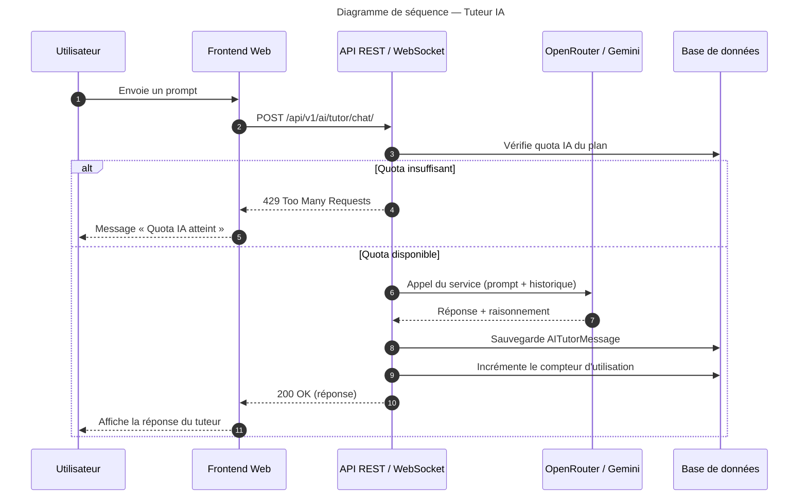
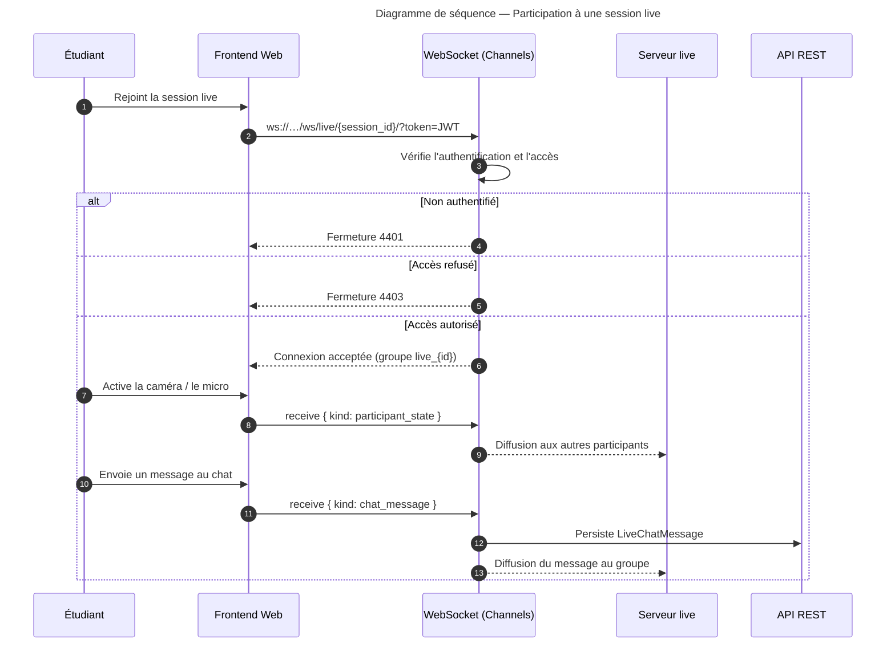

# Spécification Fonctionnelle Générale et Détaillée — EduStream LMS

---

## 1. Page de garde

| | |
|---|---|
| **Titre du projet** | EduStream LMS — Plateforme d'apprentissage en ligne |
| **Type de document** | Spécification Fonctionnelle Générale et Détaillée (SFG/SFD) |
| **Auteur** | [À compléter] |
| **Encadreur** | [À compléter] |
| **Université** | [À compléter] |
| **Filière** | [À compléter] |
| **Date** | 6 août 2026 |
| **Version du document** | 1.0 |
| **Statut** | Proposition (à valider par l'encadreur) |

---

## 2. Historique des versions

| Version | Date | Auteur | Description des modifications | Validation |
|---|---|---|---|---|
| 0.1 | 6 août 2026 | [À compléter] | Ébauche de la structure du document | — |
| 1.0 | 6 août 2026 | [À compléter] | Rédaction complète de la SFG/SFD : acteurs, besoins fonctionnels, cas d'utilisation, modèle de données, flux métier, critères d'acceptation | [À compléter] |

---

## 3. Table des matières

1. Page de garde
2. Historique des versions
3. Table des matières
4. Introduction
   - 4.1 Contexte
   - 4.2 Problématique
   - 4.3 Justification
   - 4.4 Objectifs généraux
   - 4.5 Objectifs spécifiques
   - 4.6 Portée du projet
5. Présentation générale du système
   - 5.1 Description du projet
   - 5.2 Vision globale
   - 5.3 Environnement d'utilisation
   - 5.4 Parties prenantes
6. Étude de l'existant
   - 6.1 Analyse des solutions existantes
   - 6.2 Limites
   - 6.3 Valeur ajoutée de la solution proposée
7. Acteurs du système
8. Besoins fonctionnels
9. Cas d'utilisation
   - 9.1 Diagramme de cas d'utilisation
   - 9.2 Descriptions détaillées des cas d'utilisation
10. Règles métier
11. Exigences non fonctionnelles
12. Modèle de données
    - 12.1 Description des entités
    - 12.2 Diagramme de classes
    - 12.3 Relations et contraintes
13. Description des interfaces utilisateur
14. Flux métier
    - 14.1 Diagrammes de séquence
    - 14.2 Parcours utilisateurs complets
15. Critères d'acceptation
16. Contraintes techniques
17. Hypothèses
18. Limites du projet
19. Glossaire
20. Annexes

---

## 4. Introduction

### 4.1 Contexte

L'enseignement à distance et l'apprentissage en ligne connaissent une adoption croissante. Les établissements d'enseignement, les formateurs indépendants et les apprenants recherchent des plateformes capables de centraliser la diffusion des contenus pédagogiques, le suivi de la progression, l'évaluation et la communication.

Le présent projet, **EduStream LMS**, se propose de concevoir, de développer et de documenter une plateforme de gestion de l'apprentissage (LMS — *Learning Management System*) complète, accessible depuis le Web et une application mobile. La plateforme couvre l'ensemble du cycle pédagogique : inscription, consultation des cours, lecture des leçons, réalisation de quiz et de devoirs, notation, délivrance de certificats, communication (messagerie, communauté, sessions live) et assistance pédagogique par intelligence artificielle.

### 4.2 Problématique

Les solutions LMS existantes présentent plusieurs insuffisances :

- **Coût et rigidité** : les plateformes propriétaires (Moodle, Canvas, Blackboard) sont souvent lourdes à déployer, à maintenir et à configurer pour les formateurs indépendants.
- **Manque de fonctionnalités temps réel** : la plupart des systèmes ne proposent pas de sessions live intégrées, de messagerie instantanée ni de collaboration en temps réel.
- **Suivi limité** : la progression pédagogique, les évaluations et les certificats sont souvent traités de manière cloisonnée, sans vision unifiée pour l'apprenant.
- **Absence d'assistance intelligente** : l'accompagnement personnalisé de l'apprenant (réponses, orientation, génération de contenus) est rarement intégré.
- **Monétisation absente ou complexe** : les créateurs de cours disposent rarement d'un outil intégré de facturation par abonnement ou d'achat unitaire.

La problématique peut être formulée ainsi : *comment concevoir une plateforme LMS moderne, modulaire et évolutive qui intègre l'enseignement, l'évaluation, le temps réel, la monétisation et l'intelligence artificielle au sein d'une même solution, utilisable à la fois sur le Web et en mobile ?*

### 4.3 Justification

Le choix de développer une solution propriétaire et intégrée se justifie par :

- la volonté de maîtriser l'ensemble de la chaîne de valeur pédagogique ;
- l'opportunité de démontrer une architecture logicielle complète (backend, frontend web, application mobile) dans le cadre d'un projet de fin d'études ;
- la possibilité d'intégrer nativement des services modernes (WebRTC pour le temps réel, IA générative, paiement en ligne) ;
- l'objectif de proposer une alternative légère, configurable et économiquement viable aux LMS propriétaires.

### 4.4 Objectifs généraux

1. Concevoir une plateforme LMS multi-rôles (étudiant, instructeur, administrateur) complète et cohérente.
2. Développer un backend centralisé exposant une API REST sécurisée et documentée.
3. Développer un frontend Web (SPA React) et une application mobile (Expo/React Native) consommant les mêmes services.
4. Intégrer les fonctionnalités pédagogiques, de communication, de monétisation et d'assistance IA.
5. Garantir la sécurité des données, la disponibilité des services et l'évolutivité de l'architecture.

### 4.5 Objectifs spécifiques

1. Mettre en place une authentification sécurisée par jeton JWT avec gestion des rôles et permissions.
2. Permettre la création, la publication et la consultation de cours structurés en modules et leçons.
3. Assurer le suivi de la progression des apprenants (leçons, quiz, devoirs, certificats).
4. Fournir des outils de communication : messagerie directe, communauté, groupes d'étude et sessions live.
5. Proposer un tuteur conversationnel alimenté par des services d'IA générative (Gemini, OpenRouter).
6. Intégrer la facturation par abonnement ou achat unitaire via Stripe, avec partage de revenus instructeur.
7. Fournir des tableaux de bord d'administration et de statistiques.

### 4.6 Portée du projet

**Dans le périmètre :**

- le backend Django/DRF (API REST, WebSocket, administration) ;
- le frontend Web React (SPA) ;
- l'application mobile Expo/React Native ;
- l'ensemble des modules métier : utilisateurs, cours, apprentissage, facturation, IA, live, communauté, messagerie, administration ;
- la documentation technique et fonctionnelle.

**Hors périmètre (pour cette version) :**

- le déploiement en production à grande échelle (conteneurisation, infrastructure cloud, CDN) ;
- l'intégration de vidéos en direct auto-hébergées (WebRTC est fourni par des services tiers de signalisation) ;
- les versions multilingues avancées (le socle i18n existe ; l'ensemble des contenus traduits reste à produire).

---

## 5. Présentation générale du système

### 5.1 Description du projet

EduStream est une plateforme LMS full-stack organisée en trois ensembles techniques :

| Ensemble | Technologie | Rôle |
|---|---|---|
| **Backend** | Django 5, Django REST Framework, Django Channels, PostgreSQL/SQLite | API REST, logique métier, persistance, WebSocket, administration |
| **Frontend Web** | React 19, Vite, TypeScript, Tailwind CSS, PrimeReact | Interface Web (étudiant, instructeur, administrateur) |
| **Application mobile** | Expo 54, React Native 0.81, Expo Router | Client mobile consommant les mêmes services |

Le système adopte une architecture **clients multiples + backend centralisé** : le frontend Web et l'application mobile consomment la même API REST ; les échanges temps réel transitent par Django Channels et le protocole WebSocket ; les paiements sont gérés par Stripe ; l'assistance IA repose sur Gemini et OpenRouter.

### 5.2 Vision globale

EduStream a pour ambition de fournir un écosystème pédagogique unifié où :

- l'**étudiant** apprend, s'évalue, communique, suit sa progression et obtient des certificats ;
- l'**instructeur** crée et publie des cours, suit ses étudiants, corrige les devoirs, anime des sessions live et perçoit des revenus ;
- l'**administrateur** pilote la plateforme : utilisateurs, cours, plans, transactions, rapports, support et paramètres globaux.

### 5.3 Environnement d'utilisation

| Critère | Valeur |
|---|---|
| Navigateurs cibles (Web) | Chrome, Firefox, Edge, Safari (versions récentes) |
| Mobile | Android 8+ et iOS 14+ via l'application Expo |
| Connexion | Accès Internet ; fonctionnalités temps réel dépendantes de la qualité du réseau |
| Langues | Français et anglais (i18n via i18next côté Web) |
| Fuseau horaire | Configurable au niveau serveur (défaut : Africa/Johannesburg) |

### 5.4 Parties prenantes

| Partie prenante | Rôle dans le projet |
|---|---|
| Étudiant | Utilisateur final du parcours d'apprentissage |
| Instructeur | Créateur et animateur de contenu pédagogique |
| Administrateur | Gestionnaire de la plateforme |
| Encadreur | Suivi académique du projet, validation des livrables |
| Équipe de développement | Conception, implémentation, tests |
| Services tiers | Stripe (paiement), Gemini/OpenRouter (IA), Expo Push (notifications) |

---

## 6. Étude de l'existant

### 6.1 Analyse des solutions existantes

| Solution | Forces | Faiblesses |
|---|---|---|
| **Moodle** | Open source, très complet, grande communauté | Lourd, interface datée, configuration complexe, temps réel limité |
| **Canvas LMS** | Ergonomie moderne, bon support mobile | Propriétaire, coût par étudiant, personnalisation limitée |
| **Google Classroom** | Gratuit, intégré à l'écosystème Google | Peu de suivi fin, pas de monétisation, pas de live intégré |
| **Udemy / Coursera** | Modèle de marché mature, monétisation intégrée | L'instructeur n'est pas maître de la plateforme ; pas de tuteur IA propriétaire |
| **Teachable / Thinkific** | Création de cours simplifiée, vente intégrée | Abonnement mensuel, faible profondeur fonctionnelle (pas de live, IA limitée) |

### 6.2 Limites

Les solutions étudiées présentent des limites récurrentes :

1. **Cloisonnement fonctionnel** : le suivi (progression, quiz, devoirs, certificats) est rarement unifié.
2. **Temps réel absent ou accessoire** : messagerie, chat et sessions live ne sont pas intégrés nativement.
3. **Monétisation rigide** : commissions élevées ou absence d'outil de facturation.
4. **Assistance personnalisée inexistante** : pas de tuteur IA ni de génération de contenus assistée.
5. **Coût et verrouillage** : licences propriétaires, dépendance à un fournisseur.

### 6.3 Valeur ajoutée de la solution proposée

EduStream se distingue par :

1. une **architecture unifiée et modulaire** (Web + mobile + API centralisée) ;
2. une **intégration native du temps réel** (WebSocket : live, messagerie, communauté, tuteur IA) ;
3. une **évaluation complète** (quiz, devoirs avec notation et publication des notes, certificats) ;
4. une **monétisation intégrée** (abonnements, achat de cours, partage de revenus instructeur via Stripe) ;
5. une **assistance IA native** (tuteur conversationnel, génération de modules et de leçons) ;
6. une **traçabilité pédagogique** (journal d'activité, statistiques, arbre de compétences).

---

## 7. Acteurs du système

| Acteur | Description | Responsabilités | Droits d'accès |
|---|---|---|---|
| **Étudiant** (`STUDENT`) | Apprenant inscrit sur la plateforme | Consulter le catalogue, s'inscrire aux cours, suivre les leçons, réaliser quiz et devoirs, obtenir des certificats, communiquer, utiliser le tuteur IA | Accès à ses cours, ses devoirs, ses notes, sa messagerie ; pas d'accès à l'administration |
| **Instructeur** (`INSTRUCTOR`) | Créateur de contenu pédagogique | Créer, publier et gérer les cours ; suivre les étudiants ; corriger et noter les devoirs ; animer des sessions live ; générer des contenus par IA ; percevoir des revenus | Gestion des cours dont il est propriétaire ; correction des soumissions liées à ses cours ; pas d'accès à l'administration globale |
| **Administrateur** (`ADMIN`) | Gestionnaire global de la plateforme | Gérer les utilisateurs, les cours, les plans, les transactions, les rapports, le support et les paramètres | Accès à l'ensemble des ressources et aux vues d'administration |
| **Système (acteur secondaire)** | Backend, services tiers | Valider les paiements (Stripe), générer les réponses IA (Gemini/OpenRouter), envoyer les notifications push (Expo) | Accès aux webhooks et endpoints de service |

---

## 8. Besoins fonctionnels

Chaque besoin est identifié par le préfixe **FR** (*Functional Requirement*). La priorité suit la convention suivante : **Haute** (indispensable au MVP), **Moyenne** (recommandée), **Basse** (enrichissement).

### FR-01 — Création de compte

- **Nom** : Création de compte
- **Description** : Permettre à un visiteur de créer un compte avec le rôle Étudiant ou Instructeur.
- **Acteurs concernés** : Visiteur
- **Priorité** : Haute
- **Préconditions** : Adresse email valide et non déjà utilisée.
- **Déclencheur** : L'utilisateur clique sur « Créer un compte » depuis la page d'accueil ou de connexion.
- **Scénario nominal** :
  1. L'utilisateur renseigne email, nom complet et mot de passe.
  2. Le système valide la saisie (email unique, mot de passe ≥ 8 caractères).
  3. Le système crée le compte (`role` par défaut : `STUDENT`) et génère un jeton d'accès.
  4. Le système redirige l'utilisateur vers son tableau de bord.
- **Scénarios alternatifs** :
  - A1 : L'utilisateur choisit le rôle Instructeur ; une vérification administrative peut être requise.
  - A2 : L'utilisateur confirme son email via le lien de vérification reçu (si la vérification est activée).
- **Postconditions** : Un compte actif existe ; l'utilisateur est authentifié.
- **Exceptions** : email déjà utilisé ; mot de passe trop court ; erreur serveur (erreur 5xx).

### FR-02 — Connexion et déconnexion

- **Nom** : Authentification
- **Description** : Permettre à un utilisateur de se connecter avec son email et son mot de passe et de se déconnecter.
- **Acteurs concernés** : Tous les acteurs
- **Priorité** : Haute
- **Préconditions** : Compte existant.
- **Déclencheur** : Soumission du formulaire de connexion.
- **Scénario nominal** :
  1. L'utilisateur saisit ses identifiants.
  2. Le système vérifie les informations et émet un jeton d'accès (60 minutes) et un jeton de rafraîchissement (7 jours).
  3. Le système charge le profil de l'utilisateur et redirige vers la page par défaut selon le rôle.
- **Scénarios alternatifs** : A1 : jeton expiré → renouvellement automatique via le jeton de rafraîchissement ; A2 : mot de passe oublié → flux de réinitialisation par email.
- **Postconditions** : Session authentifiée ; tokens valides.
- **Exceptions** : identifiants invalides ; compte inactif ; tentative excessive (throttling 10/min).

### FR-03 — Gestion du profil

- **Nom** : Gestion du profil
- **Description** : Consulter et modifier ses informations personnelles (nom, bio, avatar, localisation, site web, titre), changer de mot de passe, configurer ses préférences.
- **Acteurs concernés** : Tous les acteurs
- **Priorité** : Moyenne
- **Préconditions** : Utilisateur authentifié.
- **Scénario nominal** : Lecture du profil → modification des champs → sauvegarde → confirmation.
- **Postconditions** : Profil mis à jour ; notification de succès.
- **Exceptions** : champ obligatoire vide ; nouveau mot de passe incorrect.

### FR-04 — Consultation du catalogue

- **Nom** : Catalogue de cours
- **Description** : Parcourir les cours publiés, filtrer par catégorie et par tag, consulter les détails (objectifs, prérequis, note moyenne, nombre d'inscrits).
- **Acteurs concernés** : Tous les acteurs
- **Priorité** : Haute
- **Scénario nominal** : Ouverture du catalogue → affichage paginé → filtres et recherche → ouverture de la fiche cours.
- **Postconditions** : L'utilisateur peut visualiser la fiche d'un cours publié.
- **Exceptions** : cours non trouvé ; catégorie vide.

### FR-05 — Inscription à un cours et achat

- **Nom** : Enrôlement / Achat de cours
- **Description** : S'inscrire à un cours. Si le cours est payant, le paiement passe par Stripe ; si le paiement est simulé, l'inscription est immédiate.
- **Acteurs concernés** : Étudiant, Système (Stripe)
- **Priorité** : Haute
- **Préconditions** : Cours publié ; étudiant authentifié.
- **Scénario nominal** :
  1. L'étudiant clique sur « S'inscrire ».
  2. Si le cours est payant, le système crée une session de paiement Stripe et redirige vers Stripe.
  3. Après paiement réussi, le webhook/la vérification crée l'enrôlement et la transaction.
  4. L'étudiant accède au cours depuis « Mes cours ».
- **Scénarios alternatifs** : A1 : cours gratuit → enrôlement immédiat ; A2 : paiement simulé (mode démo) → enrôlement direct.
- **Postconditions** : Un enrôlement actif `(student, course)` existe.
- **Exceptions** : paiement refusé ; cours déjà acheté ; double inscription interdite (unicité).

### FR-06 — Lecture des leçons et progression

- **Nom** : Suivi du cours
- **Description** : Consulter les modules et leçons, lire les contenus (texte, vidéo, markdown), suivre sa progression (leçon démarrée / complétée, position de lecture).
- **Acteurs concernés** : Étudiant
- **Priorité** : Haute
- **Préconditions** : Étudiant enrôlé dans le cours.
- **Scénario nominal** : Ouverture du lecteur → lecture du contenu → complétion de la leçon → progression mise à jour → déverrouillage des leçons suivantes (le cas échéant).
- **Scénarios alternatifs** : A1 : leçon verrouillée par un prérequis (module non terminé) ; A2 : quiz obligatoire pour continuer.
- **Postconditions** : La progression est enregistrée ; l'activité `LESSON_COMPLETED` est journalisée.
- **Exceptions** : accès refusé (non enrôlé) ; contenu introuvable.

### FR-07 — Quiz

- **Nom** : Passation de quiz
- **Description** : Répondre à un quiz associé à une leçon ou à un module ; le score est calculé automatiquement (pourcentage de bonnes réponses) et le seuil de réussite appliqué.
- **Acteurs concernés** : Étudiant
- **Priorité** : Haute
- **Préconditions** : Étudiant enrôlé ; quiz disponible.
- **Scénario nominal** : Démarrage → réponse aux questions → soumission → calcul du score et du statut `passé/échoué` → enregistrement de la tentative → journalisation.
- **Scénarios alternatifs** : A1 : re-tentative si l'échec est permis.
- **Postconditions** : Une tentative est enregistrée ; le score et le statut sont persistés.
- **Exceptions** : temps limite dépassé (configurable, défaut 15 min).

### FR-08 — Dépôt d'un devoir

- **Nom** : Soumission d'un devoir
- **Description** : Permettre à un étudiant de rendre un devoir (fichier et/ou lien et/ou commentaire) pour un devoir de son cours.
- **Acteurs concernés** : Étudiant
- **Priorité** : Haute
- **Préconditions** : Étudiant enrôlé et actif ; devoir existant ; devoir non encore noté et publié.
- **Déclencheur** : Clic sur « Rendre » depuis la liste des devoirs ou la page de soumission.
- **Scénario nominal** :
  1. L'étudiant ouvre la page de soumission du devoir.
  2. Il dépose un fichier (extensions autorisées, ≤ 50 Mo), renseigne éventuellement un lien et un commentaire.
  3. Il valide la soumission.
  4. Le système vérifie l'enrôlement, l'extension et la taille, puis crée la soumission (`status = SUBMITTED`).
  5. Le système affiche l'écran de confirmation et met à jour la liste des devoirs.
- **Scénarios alternatifs** :
  - A1 : Ré-soumission (bouton « Modifier ») : remplacement du fichier ; si la soumission était notée, la note, le feedback et la publication sont remis à zéro.
  - A2 : Soumission par lien uniquement (aucun fichier).
  - A3 : Soumission en retard : le système signale « En retard » sans bloquer le dépôt.
- **Postconditions** : Une soumission unique `(assignment, student)` existe ; activité `ASSIGNMENT_SUBMITTED` journalisée ; notification éventuelle à l'instructeur.
- **Exceptions** : extension non autorisée ; fichier trop volumineux ; devoir déjà corrigé et publié (refus) ; double soumission gérée par remplacement.

### FR-09 — Correction et notation d'un devoir

- **Nom** : Notation des devoirs
- **Description** : Permettre à un instructeur de corriger les soumissions de ses cours : attribuer une note (0 à `points`), ajouter un feedback, puis publier les notes.
- **Acteurs concernés** : Instructeur, Administrateur
- **Priorité** : Haute
- **Préconditions** : Soumission existante ; instructeur propriétaire du cours.
- **Scénario nominal** :
  1. L'instructeur ouvre la liste des soumissions de son cours.
  2. Il sélectionne une soumission, saisit la note et le feedback.
  3. Le système valide la note (≤ `points`), met le statut à `GRADED` et crée une notification de type `GRADE`.
  4. L'instructeur publie les notes ; `is_published` passe à `true` et l'étudiant voit sa note.
- **Scénarios alternatifs** : A1 : note saisie avant publication (visible « en attente de publication ») ; A2 : modification de note avant publication.
- **Postconditions** : La soumission est notée ; la publication rend la note visible par l'étudiant.
- **Exceptions** : note hors bornes ; soumission absente ; permissions insuffisantes.

### FR-10 — Messagerie

- **Nom** : Messagerie directe
- **Description** : Créer des conversations (individuelles ou de groupe), envoyer et recevoir des messages en temps réel (WebSocket), marquer les conversations comme lues.
- **Acteurs concernés** : Tous les acteurs
- **Priorité** : Moyenne
- **Préconditions** : Utilisateur authentifié ; participant identifié.
- **Scénario nominal** : Ouverture des conversations → création d'une conversation avec des participants → envoi d'un message → diffusion temps réel aux membres → mise à jour du compteur de non-lus.
- **Postconditions** : Le message est persisté ; les membres connectés le reçoivent instantanément.
- **Exceptions** : participant inexistant ; conversation introuvable.

### FR-11 — Communauté et groupes d'étude

- **Nom** : Communauté
- **Description** : Publier des discussions liées aux cours, commenter, rejoindre des groupes d'étude et échanger en temps réel.
- **Acteurs concernés** : Tous les acteurs
- **Priorité** : Moyenne
- **Scénario nominal** : Publication d'une discussion → réponses des membres → éventuellement échanges dans un groupe d'étude.
- **Postconditions** : Les échanges sont persistés et diffusés via WebSocket.
- **Exceptions** : discussion supprimée par son auteur.

### FR-12 — Sessions live

- **Nom** : Sessions en direct
- **Description** : Planifier et animer des sessions live : salle vidéo (WebRTC), chat lié, admission des participants, réactions, lever de main, enregistrement.
- **Acteurs concernés** : Instructeur, Étudiant, Système (WebRTC/STUN)
- **Priorité** : Moyenne
- **Préconditions** : Session planifiée ; autorisation requise éventuelle.
- **Scénario nominal** : Création/planification → rappel → ouverture de la salle → participants autorisés rejoignent → échanges (état caméra/micro/partage) → fin de session.
- **Scénarios alternatifs** : A1 : session privée → demande d'entrée → accord/refus de l'hôte ; A2 : co-animateur ajouté.
- **Postconditions** : La participation est enregistrée ; le chat est persisté.
- **Exceptions** : accès refusé (code 4403) ; session inexistante (4404) ; non authentifié (4401).

### FR-13 — Tuteur IA

- **Nom** : Assistance par IA
- **Description** : Converser avec un tuteur virtuel (historique conservé), obtenir des réponses contextualisées et une chaîne de raisonnement, dans la limite du quota du plan.
- **Acteurs concernés** : Étudiant, Instructeur, Système (Gemini/OpenRouter)
- **Priorité** : Moyenne
- **Préconditions** : Utilisateur authentifié ; quota IA disponible.
- **Scénario nominal** : Envoi d'un prompt → appel du service IA → réponse affichée et sauvegardée → compteur d'utilisation incrémenté.
- **Scénarios alternatifs** : A1 : raisonnement détaillé demandé (endpoint dédié) ; A2 : génération de cours/module/leçon par l'instructeur.
- **Postconditions** : Le message et la réponse sont persistés dans la conversation.
- **Exceptions** : quota dépassé (plan limité) ; service IA indisponible (erreur service tiers).

### FR-14 — Abonnements et facturation

- **Nom** : Monétisation
- **Description** : Consulter les plans, souscrire un abonnement (Stripe), suivre sa consommation (prompts IA, minutes de streaming), consulter ses transactions et, pour l'instructeur, ses revenus.
- **Acteurs concernés** : Étudiant, Instructeur, Administrateur, Système (Stripe)
- **Priorité** : Moyenne
- **Scénario nominal** : Choix d'un plan → session de paiement Stripe → webhook → activation de l'abonnement → mise à jour du compteur de période.
- **Scénarios alternatifs** : A1 : échec de paiement → statut `PAST_DUE` ; A2 : annulation → statut `CANCELED`.
- **Postconditions** : L'abonnement et les transactions sont à jour.
- **Exceptions** : paiement refusé ; secret de webhook invalide (signature rejetée).

### FR-15 — Notifications

- **Nom** : Notifications
- **Description** : Recevoir et consulter des notifications (mise à jour de cours, devoir, note, message, session live, système), marquer comme lue, s'inscrire à la notification push (Expo).
- **Acteurs concernés** : Tous les acteurs
- **Priorité** : Moyenne
- **Scénario nominal** : Création d'une notification → affichage dans le centre de notifications → marquage comme lu → (optionnel) envoi push.
- **Postconditions** : La notification est persistée et lisible.
- **Exceptions** : aucun.

### FR-16 — Certificats

- **Nom** : Délivrance de certificats
- **Description** : Générer et télécharger un certificat à l'issue d'un cours lorsque les critères de complétion sont remplis.
- **Acteurs concernés** : Étudiant
- **Priorité** : Basse
- **Préconditions** : Critères de complétion satisfaits.
- **Scénario nominal** : Demande du certificat → vérification → création d'un code unique → mise à disposition du certificat.
- **Postconditions** : Un certificat unique `(user, course)` existe.
- **Exceptions** : critères non remplis.

### FR-17 — Administration de la plateforme

- **Nom** : Administration
- **Description** : Accéder aux statistiques globales (dashboard), aux rapports de revenus, aux tickets de support, aux paramètres de plateforme, à la diffusion de notifications et à la gestion des utilisateurs.
- **Acteurs concernés** : Administrateur
- **Priorité** : Moyenne
- **Scénario nominal** : Accès au tableau de bord → consultation des indicateurs → gestion des ressources concernées.
- **Postconditions** : Les modifications administratives sont persistées et journalisées.
- **Exceptions** : accès refusé (rôle insuffisant) — permission `ADMIN` requise.

### FR-18 — Arbre de compétences

- **Nom** : Arbre de compétences
- **Description** : Visualiser et débloquer progressivement des compétences reliées à des cours.
- **Acteurs concernés** : Étudiant
- **Priorité** : Basse
- **Préconditions** : Utilisateur authentifié.
- **Scénario nominal** : Visualisation de l'arbre → déblocage d'une compétence → progression enregistrée.
- **Postconditions** : Le statut des compétences est mis à jour.
- **Exceptions** : aucun.

---

## 9. Cas d'utilisation

### 9.1 Diagramme de cas d'utilisation

### 9.2 Descriptions détaillées des cas d'utilisation

#### UC-01 — S'authentifier

| Élément | Description |
|---|---|
| **Nom** | S'authentifier |
| **Acteurs** | Étudiant, Instructeur, Administrateur |
| **Préconditions** | Compte actif |
| **Scénario principal** | 1. L'acteur ouvre la page de connexion. 2. Il saisit email et mot de passe. 3. Le système valide et émet les jetons JWT. 4. Le système redirige vers l'espace du rôle. |
| **Variantes** | V1 : inscription ; V2 : réinitialisation du mot de passe ; V3 : renouvellement automatique du jeton |
| **Résultat attendu** | Session authentifiée, accès au tableau de bord |

#### UC-02 — Consulter le catalogue

| Élément | Description |
|---|---|
| **Nom** | Consulter le catalogue |
| **Acteurs** | Étudiant, Instructeur, Administrateur (visiteur non connecté limité) |
| **Préconditions** | — |
| **Scénario principal** | 1. L'acteur ouvre le catalogue. 2. Il filtre par catégorie ou recherche. 3. Il consulte la fiche d'un cours. |
| **Variantes** | V1 : cours en vedette |
| **Résultat attendu** | Fiche du cours affichée |

#### UC-03 — S'inscrire / acheter un cours

| Élément | Description |
|---|---|
| **Nom** | S'inscrire / acheter un cours |
| **Acteurs** | Étudiant, Système (Stripe) |
| **Préconditions** | Étudiant authentifié ; cours publié |
| **Scénario principal** | 1. L'étudiant clique sur « S'inscrire ». 2. Pour un cours payant, le système crée une session de paiement Stripe. 3. Le paiement aboutit. 4. L'enrôlement et la transaction sont créés. 5. Le cours apparaît dans « Mes cours ». |
| **Variantes** | V1 : cours gratuit ; V2 : mode paiement simulé |
| **Résultat attendu** | Enrôlement actif et accès au cours |

#### UC-04 — Suivre les leçons

| Élément | Description |
|---|---|
| **Nom** | Suivre les leçons |
| **Acteurs** | Étudiant |
| **Préconditions** | Enrôlement actif |
| **Scénario principal** | 1. L'étudiant ouvre le lecteur. 2. Il consulte le contenu (vidéo/texte/markdown). 3. Il marque la leçon comme complétée. 4. La progression est mise à jour. |
| **Variantes** | V1 : leçon verrouillée par prérequis ; V2 : quiz requis pour continuer |
| **Résultat attendu** | Progression enregistrée |

#### UC-05 — Passer un quiz

| Élément | Description |
|---|---|
| **Nom** | Passer un quiz |
| **Acteurs** | Étudiant |
| **Préconditions** | Enrôlement actif ; quiz disponible |
| **Scénario principal** | 1. L'étudiant démarre le quiz. 2. Il répond aux questions. 3. Il soumet. 4. Le système calcule le score et le statut. |
| **Variantes** | V1 : nouvelle tentative |
| **Résultat attendu** | Tentative enregistrée, score et statut persistés |

#### UC-06 — Rendre un devoir

| Élément | Description |
|---|---|
| **Nom** | Rendre un devoir |
| **Acteurs** | Étudiant |
| **Préconditions** | Enrôlement actif ; devoir non noté/publié |
| **Scénario principal** | 1. L'étudiant ouvre la page de soumission. 2. Il joint un fichier et/ou un lien. 3. Il soumet. 4. Le système valide et crée la soumission. |
| **Variantes** | V1 : ré-soumission (remplacement du fichier, remise à zéro de la note éventuelle) ; V2 : soumission en retard |
| **Résultat attendu** | Soumission `SUBMITTED` créée et visible dans la liste |

#### UC-07 — Consulter ses notes

| Élément | Description |
|---|---|
| **Nom** | Consulter ses notes |
| **Acteurs** | Étudiant |
| **Préconditions** | Soumissions notées et publiées |
| **Scénario principal** | 1. L'étudiant ouvre la page « Notes ». 2. Il consulte les notes publiées, la moyenne et le détail d'une soumission (feedback). |
| **Variantes** | V1 : note saisie mais non publiée (visible en « publication en attente ») |
| **Résultat attendu** | Notes et feedback affichés |

#### UC-08 — Corriger et noter les devoirs

| Élément | Description |
|---|---|
| **Nom** | Corriger et noter les devoirs |
| **Acteurs** | Instructeur, Administrateur |
| **Préconditions** | Soumission existante ; propriété du cours |
| **Scénario principal** | 1. L'instructeur ouvre la liste des soumissions. 2. Il saisit la note et le feedback. 3. Le système enregistre (statut `GRADED`) et notifie. 4. Il publie les notes. |
| **Variantes** | V1 : modification avant publication |
| **Résultat attendu** | Note enregistrée puis publiée |

#### UC-09 — Participer à une session live

| Élément | Description |
|---|---|
| **Nom** | Participer à une session live |
| **Acteurs** | Instructeur (hôte), Étudiant, Système (WebRTC) |
| **Préconditions** | Session planifiée ; accès autorisé |
| **Scénario principal** | 1. L'hôte ouvre la salle. 2. Les participants autorisés rejoignent. 3. Les états (caméra/micro/partage/réactions) sont diffusés. 4. La session se termine. |
| **Variantes** | V1 : demande d'entrée pour session privée ; V2 : co-animateur |
| **Résultat attendu** | Session temps réel, chat persisté |

#### UC-10 — Utiliser le tuteur IA

| Élément | Description |
|---|---|
| **Nom** | Utiliser le tuteur IA |
| **Acteurs** | Étudiant, Instructeur, Système (Gemini/OpenRouter) |
| **Préconditions** | Authentifié ; quota IA disponible |
| **Scénario principal** | 1. L'utilisateur envoie un prompt. 2. Le système appelle le service IA. 3. La réponse est affichée et sauvegardée. |
| **Variantes** | V1 : raisonnement détaillé ; V2 : génération de contenus par l'instructeur |
| **Résultat attendu** | Réponse IA persistée dans la conversation |

#### UC-11 — Gérer l'administration

| Élément | Description |
|---|---|
| **Nom** | Gérer l'administration |
| **Acteurs** | Administrateur |
| **Préconditions** | Rôle `ADMIN` |
| **Scénario principal** | L'administrateur accède aux statistiques, rapports, utilisateurs, plans, transactions, support et paramètres. |
| **Variantes** | V1 : diffusion de notifications ; V2 : gestion des tickets |
| **Résultat attendu** | Actions d'administration persistées |

---

## 10. Règles métier

| ID | Règle métier |
|---|---|
| **RM-01** | Un utilisateur ne possède qu'un seul compte par adresse email (unicité de `User.email`). |
| **RM-02** | Les rôles sont exclusifs : `STUDENT`, `INSTRUCTOR` ou `ADMIN`. Chaque rôle conditionne l'accès aux interfaces et aux actions. |
| **RM-03** | Un étudiant ne peut être enrôlé qu'une seule fois dans un cours donné (unicité `(student, course)`). |
| **RM-04** | Une soumission de devoir est unique par couple `(assignment, student)`. Toute nouvelle soumission remplace la précédente. |
| **RM-05** | Une soumission ne peut être modifiée (ré-soumission) si elle a été **publiée** (note rendue visible). |
| **RM-06** | La ré-soumission d'un devoir déjà noté remet la note, le feedback et la publication à zéro ; la soumission repasse à l'état `SUBMITTED`. |
| **RM-07** | La note attribuée doit être comprise entre 0 et le barème du devoir (`points`), bornes incluses. |
| **RM-08** | La publication de la note est un acte distinct de la saisie : une note peut être saisie sans être publiée. |
| **RM-09** | Le statut d'une soumission suit le cycle : `SUBMITTED` → `GRADED` → (publication) ; le statut `MISSING` est réservé aux devoirs non rendus. |
| **RM-10** | Le retard de soumission est déterminé par comparaison entre `submitted_at` et l'échéance effective (échéance initiale ou extension accordée). |
| **RM-11** | Une extension de délai est unique par couple `(assignment, student)`. |
| **RM-12** | Le score d'un quiz correspond au pourcentage de bonnes réponses ; le quiz est réussi si score ≥ `passing_score` (défaut 70). |
| **RM-13** | Un cours ne peut être publié que s'il contient au moins un module publié avec au moins une leçon publiée. |
| **RM-14** | Seul l'instructeur propriétaire du cours (ou un administrateur) peut modifier un cours, ses modules, leçons et corriger les soumissions associées. |
| **RM-15** | La consultation d'une leçon peut être conditionnée par la complétion des modules prérequis ou la réussite d'un quiz (chaîne `require_quiz_pass_to_continue`). |
| **RM-16** | Le partage des revenus suit une répartition fixe : commission plateforme `platform_fee_percentage` (défaut 30 %), reste à l'instructeur. |
| **RM-17** | L'utilisation de l'IA est limitée par plan (quota de prompts mensuel, défaut 20 pour le plan gratuit) ; les minutes de streaming sont également bornées (0 = illimité). |
| **RM-18** | Un certificat est unique par couple `(user, course)` et possède un code unique. |
| **RM-19** | Les sessions live ont un nom de salle (`room_name`) unique. Un participant est unique par session `(session, user)`. |
| **RM-20** | Le webhook Stripe doit être validé par signature ; sans secret, la plateforme bascule en mode paiement simulé (démo). |

---

## 11. Exigences non fonctionnelles

| Catégorie | Exigence | Critère / valeur cible |
|---|---|---|
| **Sécurité** | Authentification par JWT | Jeton d'accès : 60 min ; jeton de rafraîchissement : 7 jours ; rotation + blacklist activés |
| | Confidentialité des mots de passe | Hachage par le framework Django (PBKDF2/Argon2 selon configuration) |
| | Protection des endpoints | Permission globale `IsAuthenticated` ; permissions de rôle et de propriété |
| | CORS | Origines autorisées configurées (défaut : localhost:3000, 127.0.0.1:3000) ; credentials activés |
| | HTTPS | Redirection SSL et HSTS activées hors mode DEBUG |
| | Anti-scripting | Échappement des sorties côté React ; validation des entrées côté API |
| | Anti-injection SQL | Requêtes via l'ORM Django (requêtes paramétrées) |
| **Performance** | Pagination | Pagination par numéro de page, taille par défaut 20 |
| | Cache | Cache Redis (ou mémoire) pour le catalogue et données fréquentes (timeout 300 s) |
| | Throttling | anon 60/min, user 300/min, auth 10/min, register 5/h, password_reset 5/h, verify 10/h, IA 20/min |
| | Temps de réponse cible | < 500 ms pour les requêtes API courantes (hors IA/streaming) |
| **Disponibilité** | Service API | Objectif de disponibilité du service : 99 % (hors maintenance) |
| | Temps réel | WebSocket maintenu via Channels ; reconnexion gérée côté client |
| **Fiabilité** | Intégrité des paiements | Vérification du statut de paiement avant création de l'enrôlement |
| | Journalisation | Logs tournants : `logs/auth.log` (5 Mo × 3) et `logs/errors.log` (10 Mo × 5) |
| **Accessibilité** | Navigation au clavier | Composants PrimeReact accessibles (ARIA) |
| | Contrastes et tailles | Thème cohérent, tailles de police lisibles |
| **Ergonomie** | Cohérence visuelle | Design system Tailwind + PrimeReact, thème clair/sombre |
| | Feedback utilisateur | Notifications (toasts) pour chaque action significative |
| **Compatibilité** | Navigateurs | Chrome, Firefox, Edge, Safari (versions récentes) |
| | Mobile | Android 8+, iOS 14+ |
| **Maintenabilité** | Architecture modulaire | Apps Django par domaine ; services front/mobile centralisés |
| | Documentation | OpenAPI (drf-spectacular) accessible sur `/api/schema/` et `/api/docs/` |
| **Évolutivité** | Base de données | SQLite en local, PostgreSQL en cible (psycopg3) |
| | Cache/Channels | Redis mutualisable (channel layer et cache) |
| | Stockage | Media en local, migration possible vers stockage objet |

---

## 12. Modèle de données

### 12.1 Description des entités

Le modèle de données comprend une trentaine d'entités réparties par domaine métier. Les clés primaires sont des **UUID** (à l'exception de quelques tables techniques à identifiant auto-incrémenté). Le tableau suivant présente les entités principales.

| Domaine | Entité | Champs principaux |
|---|---|---|
| Utilisateurs | **User** | id (UUID), email (unique), full_name, role, is_active, email_verified, avatar_url, bio, preferences |
| Cours | **Category** | id, name (unique), slug, is_active |
| | **Course** | id, title, slug, category (FK), tags (M2M), price, is_published, instructor (FK), platform_fee_percentage, level |
| | **Section / Module / Lesson** | organisation hiérarchique : course → sections/modules → leçons |
| | **Lesson** | title, lesson_type, video_url, status, is_preview, order |
| | **ContentBlock** | lesson (FK), kind (MARKDOWN/TEXT/VIDEO/CODE/EMBED/IMAGE/FILE/QUIZ), data (JSON), order |
| | **Enrollment** | student (FK), course (FK), is_active — unique `(student, course)` |
| | **Progress** | enrollment (FK), lesson (FK), completion, is_completed — unique `(enrollment, lesson)` |
| | **Certificate** | user (FK), course (FK), certificate_code (unique) |
| Apprentissage | **Assignment** | course (FK), title, due_date, points, type, allowed_extensions (JSON), max_file_size_mb |
| | **Submission** | assignment (FK), student (FK), content_text, file_url, file_name, file_size, grade, feedback, status, is_published — unique `(assignment, student)` |
| | **Extension** | assignment (FK), student (FK), new_deadline — unique `(assignment, student)` |
| | **Quiz / QuizQuestion / QuizAttempt** | quiz → questions ; tentatives avec score et statut |
| | **Notification** | user (FK), notification_type, title, body, link, is_read |
| | **Skill / UserSkill / SkillTree / SkillNode / SkillEdge** | arbre de compétences |
| Facturation | **SubscriptionPlan** | name, price_monthly, features (JSON), audience, quotas IA/streaming |
| | **UserSubscription** | user (O2O), plan (FK), status, période courante, compteurs |
| | **Transaction** | student (FK), course (FK), amount_paid, platform_fee, instructor_earning, status |
| IA | **AITutorConversation / AITutorMessage** | conversations et messages IA (prompt, response) |
| Live | **LiveSession** | course (FK), instructor (FK), scheduled_at, room_name (unique), status |
| | **LiveParticipant** | session (FK), user (FK), role, is_mic_on, is_camera_on — unique `(session, user)` |
| | **LiveChatMessage** | session (FK), user (FK), content |
| Communauté | **Discussion / DiscussionComment / StudyGroup / StudyGroupMessage** | échanges et groupes d'étude |
| Messagerie | **Conversation / ConversationParticipant / Message** | conversations, participants, messages |
| Administration | **SupportTicket** | user (FK), subject, message, status, priority |
| | **PlatformSetting** | key (unique), value |

### 12.2 Diagramme de classes

> **Note pédagogique** : le diagramme ci-dessus est une simplification orientée fonctionnalités. Les entités *Section*, *ConversationParticipant*, *PushDevice*, *PlatformSetting* et les tables de l'arbre de compétences ne sont pas détaillées ici pour la lisibilité ; elles figurent dans le modèle physique (voir annexe A).

### 12.3 Relations et contraintes

- **Relations hiérarchiques** : `Course → Section → Module → Lesson → ContentBlock` (suppression en cascade à chaque niveau).
- **Contraintes d'unicité** : `(student, course)` pour Enrollment ; `(enrollment, lesson)` pour Progress ; `(assignment, student)` pour Submission ; `(user, course)` pour Certificate ; `(session, user)` pour LiveParticipant ; `(conversation, user)` pour ConversationParticipant.
- **Intégrité référentielle** : clés étrangères avec `CASCADE` pour les agrégats (cours, leçons, soumissions, messages) ; `SET_NULL` pour les références optionnelles (catégorie de cours, section d'un module, parent de commentaire).
- **Échéance effective** : dérivée de `Assignment.due_date` ou `Extension.new_deadline` (calcul dans le modèle `Submission`).
- **Propriété** : l'instructeur d'un cours est propriétaire de l'arborescence pédagogique et des soumissions liées (permission `IsInstructorOwnerOrAdmin`).

---

## 13. Description des interfaces utilisateur

### 13.1 Écrans Étudiant

#### E01 — Page d'accueil / Landing

- **Objectif** : présenter la plateforme et orienter l'utilisateur (connexion, inscription, tarifs).
- **Composants** : barre de navigation publique, hero, fonctionnalités, tarifs, pied de page.
- **Règles de validation** : —.
- **Actions possibles** : « Se connecter », « Créer un compte », « Voir les tarifs ».
- **Messages d'erreur** : —.

#### E02 — Connexion / Inscription

- **Objectif** : authentifier un utilisateur ou créer un compte.
- **Composants** : champs email/mot de passe, bouton « Se connecter », lien « Mot de passe oublié », bascule vers l'inscription.
- **Règles de validation** : email valide ; mot de passe requis (≥ 8 caractères à l'inscription).
- **Actions possibles** : connexion, inscription, « Se souvenir de moi ».
- **Messages d'erreur** : « Identifiants incorrects », « Email déjà utilisé », « Mot de passe trop court ».

#### E03 — Tableau de bord

- **Objectif** : vue d'ensemble des cours en cours, progression, notifications.
- **Composants** : liste des cours, barre de progression, indicateurs, liens rapides (Devoirs, Notes, Live, IA).
- **Actions possibles** : ouvrir un cours, ouvrir un module.
- **Messages d'erreur** : « Impossible de charger les données ».

#### E04 — Catalogue

- **Objectif** : parcourir les cours publiés.
- **Composants** : grille de cartes, recherche, filtres par catégorie, pagination.
- **Actions possibles** : ouvrir la fiche cours, s'inscrire.

#### E05 — Fiche cours

- **Objectif** : détailler un cours (programme, prérequis, avis).
- **Composants** : description, modules, avis, bouton « S'inscrire » / « Acheter ».
- **Règles de validation** : affichage conditionnel selon l'état d'enrôlement.
- **Actions possibles** : inscription, ouverture du lecteur si déjà enrôlé.

#### E06 — Lecteur de cours

- **Objectif** : lire les leçons et suivre sa progression.
- **Composants** : sommaire des modules/leçons, zone de contenu (vidéo/texte/markdown), bouton « Leçon suivante ».
- **Règles de validation** : leçons verrouillées selon prérequis.
- **Actions possibles** : navigation, complétion d'une leçon.
- **Messages d'erreur** : « Cette leçon nécessite d'abord… ».

#### E07 — Devoirs (liste)

- **Objectif** : visualiser les devoirs de ses cours et leur état.
- **Composants** : sélecteur de cours, cartes de devoirs, badges d'état (À rendre / Soumis / Noté / Manquant / En retard), barre de progression par cours.
- **Actions possibles** : « Rendre », « Modifier », « Voir » (détail d'une soumission).
- **Messages d'erreur** : « Impossible de charger les données ».

#### E08 — Soumission de devoir

- **Objectif** : déposer un devoir (fichier et/ou lien et/ou commentaire).
- **Composants** : consignes, zone de dépôt (glisser-déposer), aperçu du fichier actuel, champ lien optionnel, champ commentaires, bouton de validation.
- **Règles de validation** : extensions autorisées ; taille ≤ 50 Mo ; lien au format URL.
- **Actions possibles** : déposer, retirer, soumettre, annuler, « Voir ma soumission ».
- **Messages d'erreur** : « Extension non autorisée », « Fichier trop volumineux (max 50 Mo) », « Ce devoir a déjà été corrigé et publié. »

#### E09 — Notes

- **Objectif** : consulter les notes publiées.
- **Composants** : tableau des notes, moyenne, bouton « Voir » ouvrant le détail de la soumission (note, feedback, fichier).
- **Actions possibles** : consulter le détail.

#### E10 — Messagerie

- **Objectif** : discuter en direct (WebSocket).
- **Composants** : liste des conversations, zone de discussion, compteurs de non-lus.
- **Actions possibles** : nouvelle conversation, envoi de message, marquer comme lu.

#### E11 — Communauté

- **Objectif** : échanger en public ou en groupe d'étude.
- **Composants** : fil de discussions, commentaires, groupes d'étude.
- **Actions possibles** : publier, commenter, rejoindre un groupe.

#### E12 — Session live

- **Objectif** : participer à une salle vidéo temps réel.
- **Composants** : grille vidéo, barre d'outils (micro/caméra/partage), chat, réactions, lever de main.
- **Actions possibles** : rejoindre, activer/désactiver micro/caméra, envoyer un message, lever la main.

### 13.2 Écrans Instructeur

#### E13 — Tableau de bord instructeur

- **Objectif** : vue d'ensemble des cours, revenus, étudiants.
- **Composants** : indicateurs, graphiques (Recharts), liste des cours.
- **Actions possibles** : accéder à un cours, aux statistiques.

#### E14 — Gestion des cours

- **Objectif** : créer et structurer un cours (modules, leçons, contenus, ressources).
- **Composants** : éditeur de structure, éditeur de contenu (Quill/markdown), gestion des versions.
- **Actions possibles** : publier, importer un plan de cours, générer par IA.

#### E15 — Devoirs (instructeur)

- **Objectif** : créer des devoirs et suivre les soumissions.
- **Composants** : liste des devoirs, liste des soumissions, bouton « Noter », bouton « Publier les notes ».
- **Règles de validation** : note comprise entre 0 et le barème.
- **Actions possibles** : corriger, noter, publier, prolonger le délai.
- **Messages d'erreur** : « Note hors barème », « Permission insuffisante ».

#### E16 — Élèves

- **Objectif** : suivre les étudiants d'un cours.
- **Composants** : liste, progression, vue détaillée par étudiant.
- **Actions possibles** : consulter, retirer un étudiant.

#### E17 — Sessions live (instructeur)

- **Objectif** : planifier et animer des sessions.
- **Composants** : agenda, salle vidéo, gestion des entrées (admission), co-animateurs.
- **Actions possibles** : planifier, ouvrir, admettre/refuser, terminer.

### 13.3 Écrans Administrateur

#### E18 — Tableau de bord admin

- **Objectif** : piloter la plateforme.
- **Composants** : statistiques globales (utilisateurs, cours, revenus), graphiques.
- **Actions possibles** : navigation vers les modules d'administration.

#### E19 — Utilisateurs

- **Objectif** : gérer les comptes.
- **Composants** : tableau, recherche, fiche détaillée.
- **Actions possibles** : consulter, activer/désactiver, modifier.

#### E20 — Plans et transactions

- **Objectif** : gérer les plans d'abonnement, consulter les transactions, rembourser.
- **Composants** : liste des plans, liste des transactions.
- **Actions possibles** : créer/modifier un plan, rembourser une transaction.

#### E21 — Support et paramètres

- **Objectif** : traiter les tickets et configurer la plateforme.
- **Composants** : file de tickets, formulaire de paramètres clé/valeur, diffusion de notifications.
- **Actions possibles** : changer le statut d'un ticket, mettre à jour un paramètre, diffuser.

---

## 14. Flux métier

### 14.1 Diagrammes de séquence

#### 14.1.1 Flux « Dépôt de devoir → Correction → Publication »

#### 14.1.2 Flux « Achat d'un cours avec Stripe »

#### 14.1.3 Flux « Conversation avec le tuteur IA »

#### 14.1.4 Flux « Session live »

### 14.2 Parcours utilisateurs complets

**Parcours « Apprenant »** :

1. Création de compte / connexion → 2. Parcours du catalogue → 3. Inscription (ou achat) à un cours → 4. Lecture des leçons et progression → 5. Passation des quiz → 6. Rendu des devoirs → 7. Correction et publication par l'instructeur → 8. Consultation des notes → 9. Obtention du certificat → 10. Interaction (messagerie, communauté, live, tuteur IA).

**Parcours « Instructeur »** :

1. Création d'un cours (structure manuelle ou générée par IA) → 2. Publication → 3. Suivi des étudiants → 4. Création des devoirs → 5. Correction et notation → 6. Publication des notes → 7. Animation de sessions live → 8. Consultation des revenus.

**Parcours « Administrateur »** :

1. Connexion → 2. Tableau de bord et statistiques → 3. Gestion des utilisateurs → 4. Gestion des plans et transactions → 5. Traitement du support → 6. Paramétrage et diffusion de notifications.

---

## 15. Critères d'acceptation

Pour chaque fonctionnalité, les critères suivants définissent les conditions de validation (format *Given / When / Then*).

| ID | Critère d'acceptation |
|---|---|
| **CA-01** | Étant donné un visiteur, quand il crée un compte avec un email inutilisé et un mot de passe valide, alors le compte est créé et il est redirigé vers son tableau de bord. |
| **CA-02** | Étant donné un utilisateur avec des identifiants valides, quand il se connecte, alors il accède à l'espace correspondant à son rôle. |
| **CA-03** | Étant donné un étudiant authentifié, quand il s'inscrit à un cours gratuit, alors l'enrôlement est immédiat et le cours apparaît dans « Mes cours ». |
| **CA-04** | Étant donné un étudiant authentifié, quand il achète un cours payant via Stripe et que le paiement aboutit, alors une transaction et un enrôlement sont créés et le cours est accessible. |
| **CA-05** | Étant donné un étudiant enrôlé, quand il complète une leçon, alors la progression est mise à jour et l'activité est journalisée. |
| **CA-06** | Étant donné un étudiant enrôlé, quand il soumet un quiz, alors la tentative est enregistrée avec son score et son statut calculés automatiquement. |
| **CA-07** | Étant donné un étudiant enrôlé avec un devoir non noté, quand il dépose un fichier valide, alors la soumission `SUBMITTED` est créée et affichée dans la liste. |
| **CA-08** | Étant donné un étudiant ayant une soumission, quand il soumet à nouveau un fichier valide, alors le fichier est remplacé ; si la soumission était notée, la note et le feedback sont remis à zéro. |
| **CA-09** | Étant donné un étudiant, quand il tente de modifier une soumission publiée, alors le système refuse (message « Cette soumission a déjà été publiée »). |
| **CA-10** | Étant donné un fichier non autorisé ou supérieur à 50 Mo, quand l'étudiant le dépose, alors le système refuse la soumission avec un message explicite. |
| **CA-11** | Étant donné un instructeur propriétaire, quand il note une soumission avec une note comprise dans le barème, alors le statut passe à `GRADED` et une notification est créée. |
| **CA-12** | Étant donné un instructeur, quand il publie les notes, alors les notes deviennent visibles par les étudiants concernés. |
| **CA-13** | Étant donné un utilisateur non autorisé, quand il tente d'accéder à une ressource administrative ou à un cours dont il n'est pas propriétaire, alors le système refuse l'accès (403). |
| **CA-14** | Étant donné un utilisateur authentifié, quand il envoie un message, alors les participants connectés le reçoivent en temps réel et le message est persisté. |
| **CA-15** | Étant donné un utilisateur avec un plan gratuit, quand il dépasse son quota IA mensuel, alors le système refuse l'appel IA (429) et affiche un message. |
| **CA-16** | Étant donné un webhook Stripe signé valide, quand un événement de paiement est reçu, alors l'abonnement est mis à jour en conséquence. |
| **CA-17** | Étant donné un étudiant ayant rempli les critères de complétion, quand il demande son certificat, alors un certificat avec un code unique est généré. |

---

## 16. Contraintes techniques

| ID | Contrainte | Détail |
|---|---|---|
| **CT-01** | Langage backend | Python 3.10+ (3.12 constaté) |
| **CT-02** | Framework backend | Django 5.2.11 ; API : Django REST Framework 3.16.1 |
| **CT-03** | Authentification | JWT via `djangorestframework-simplejwt` 5.5.1 (rotation + blacklist) |
| **CT-04** | Temps réel | Django Channels 4.3.1 (ASGI) ; channel layer Redis ou en mémoire |
| **CT-05** | Frontend | React 19, Vite 6, TypeScript 5.8, Tailwind CSS 4, PrimeReact 10 |
| **CT-06** | Mobile | Expo 54 / React Native 0.81, Expo Router |
| **CT-07** | Base de données | SQLite (local) ; PostgreSQL cible via psycopg 3 |
| **CT-08** | Paiement | Stripe 13.0.0 (Checkout, Webhook, mode simulé en démo) |
| **CT-09** | IA | Gemini 2.0 Flash (Google Generative AI 0.8.5) et OpenRouter (`cohere/north-mini-code:free`) |
| **CT-10** | Documentation API | drf-spectacular 0.28.0 (`/api/schema/`, `/api/docs/`) |
| **CT-11** | Filtres/pagination | django-filter 25.1 ; pagination `PageNumberPagination` (taille 20) |
| **CT-12** | Identifiants | UUID pour les entités métier ; `BigAutoField` par défaut Django |
| **CT-13** | Identifiant utilisateur | `AUTH_USER_MODEL = users.User` (email comme identifiant de connexion) |
| **CT-14** | WebRTC | STUN publics Google par défaut ; TURN configurable ; signalisation par WebSocket |

---

## 17. Hypothèses

1. Les contenus pédagogiques (cours, leçons, quiz, devoirs) sont saisis par les instructeurs en langue française ou anglaise.
2. La plateforme est utilisée en mode **démonstration** pendant la soutenance : le paiement peut être simulé (`ENABLE_MOCK_PAYMENTS`), les clés IA et Stripe étant fournies par variables d'environnement.
3. Le volume de données initial est faible (jeu de données de démonstration), d'où une base SQLite acceptable en développement.
4. Les fichiers téléversés (devoirs, médias) sont stockés localement dans `backend/media/` dans cette version.
5. La vérification des emails peut être désactivée en mode développement ; en production, elle est obligatoire.
6. Les services tiers (Stripe, Gemini, OpenRouter, Expo Push) sont supposés disponibles et opérationnels pendant la soutenance, ou leurs modes de repli (paiement simulé, réponse locale) activés.
7. Le fuseau horaire et la langue par défaut de la plateforme sont configurés au niveau serveur.

---

## 18. Limites du projet

1. **Déploiement** : aucune conteneurisation (Docker) ni configuration d'infrastructure cloud n'est fournie dans cette version.
2. **Stockage média** : stockage local uniquement ; une migration vers un stockage objet (S3/Cloud Storage) reste à réaliser pour la production.
3. **Vidéoconférence** : WebRTC repose sur des serveurs STUN/TURN publics par défaut ; la qualité des flux dépend du réseau.
4. **Traductions** : le socle d'internationalisation existe (i18next) mais l'intégralité des contenus n'est pas traduite.
5. **Couverture des tests** : les tests couvrent les modules principaux (auth, learning, billing, cours, IA) ; la couverture des flux temps réel et mobiles reste perfectible.
6. **Sécurité de production** : les clés API sont gérées par variables d'environnement ; la rotation régulière et le durcissement HTTPS relèvent de l'exploitation.
7. **Génération de cours par IA** : le flux « générer un cours complet » est partiellement simulé (structure codée en dur) ; la génération de modules et de leçons est opérationnelle.

---

## 19. Glossaire

| Terme | Définition |
|---|---|
| **API REST** | Interface de programmation exposant des ressources via HTTP (méthodes GET, POST, PATCH, PUT, DELETE). |
| **ASGI** | *Asynchronous Server Gateway Interface* — protocole serveur Python supportant HTTP et WebSocket. |
| **CORS** | *Cross-Origin Resource Sharing* — mécanisme autorisant les requêtes depuis des origines web autorisées. |
| **CRUD** | *Create, Read, Update, Delete* — opérations de base sur une ressource. |
| **DRF** | Django REST Framework. |
| **JWT** | *JSON Web Token* — jeton signé transportant l'identité de l'utilisateur (accès + rafraîchissement). |
| **LMS** | *Learning Management System* — système de gestion de l'apprentissage. |
| **M2M** | Relation *many-to-many* entre deux entités. |
| **SPA** | *Single Page Application* — application web à page unique sans rechargement. |
| **STUN/TURN** | Protocoles de signalisation pour la vidéo WebRTC (découverte d'adresse et relais). |
| **Throttling** | Limitation du nombre de requêtes sur une période donnée. |
| **UUID** | *Universally Unique Identifier* — identifiant unique global. |
| **WebRTC** | *Web Real-Time Communication* — technologie de communication audio/vidéo pair-à-pair. |
| **WebSocket** | Protocole de communication bidirectionnelle temps réel. |
| **Webhook** | Appel HTTP déclenché par un événement d'un service externe (ex. Stripe). |

---

## 20. Annexes

### Annexe A — Sources de vérification

- `backend/config/settings.py` : configuration générale (apps, middleware, JWT, pagination, throttling, CORS, cache, channels).
- `backend/config/urls.py` et `apps/*/urls.py` : catalogue des endpoints REST.
- `backend/config/asgi.py` et `apps/*/routing.py` : routage WebSocket.
- `backend/apps/*/models.py` : modèle de données physique.
- `backend/apps/*/views.py` et `serializers.py` : comportement des endpoints.
- `edustream/package.json` et `pnpm-lock.yaml` : dépendances frontend.
- `edustream/src/App.tsx` : catalogue des routes du frontend Web.
- `backend/schema.yml` : schéma OpenAPI généré.

### Annexe B — Références

- Documentation Django 5 — <https://docs.djangoproject.com/>
- Documentation Django REST Framework — <https://www.django-rest-framework.org/>
- Documentation Django Channels — <https://channels.readthedocs.io/>
- Documentation SimpleJWT — <https://django-rest-framework-simplejwt.readthedocs.io/>
- Documentation Stripe — <https://docs.stripe.com/>
- Documentation Expo — <https://docs.expo.dev/>

### Annexe C — Propositions d'amélioration

1. **Conteneurisation** : ajouter un `Dockerfile` et un `docker-compose.yml` (web, worker ASGI, PostgreSQL, Redis) pour fiabiliser le déploiement.
2. **Intégration continue** : mettre en place une CI (lint, tests unitaires, génération du schéma OpenAPI) pour garantir la qualité du code.
3. **Stockage objet** : migrer les médias vers un stockage objet externe et un CDN.
4. **Tests de bout en bout** : automatiser les parcours critiques (connexion, achat, soumission, correction) avec des tests E2E.
5. **Observabilité** : instrumenter les métriques (latence API, WebSocket, erreurs) et ajouter des alertes.
6. **Traduction complète** : finaliser l'internationalisation de l'interface (français/anglais) côté Web et mobile.

---

*Document rédigé dans le cadre du projet de fin d'études « EduStream LMS ». Les informations techniques sont issues de l'analyse du dépôt de code (état au 6 août 2026). Les mentions [À compléter] concernent des données personnelles et académiques fournies par l'auteur.*
